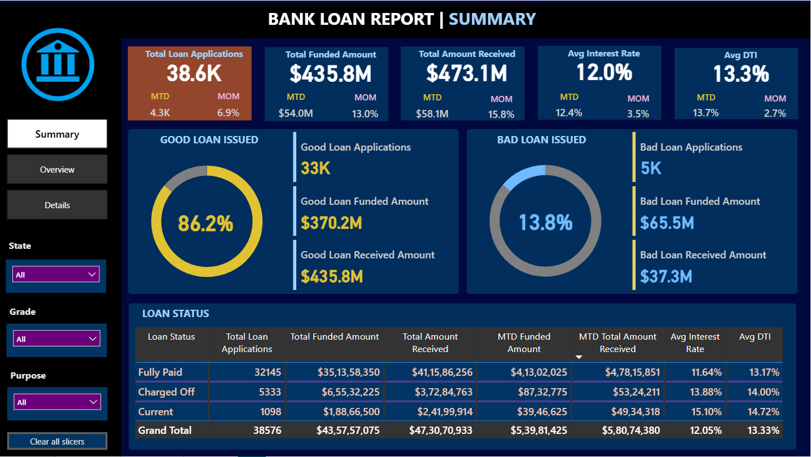
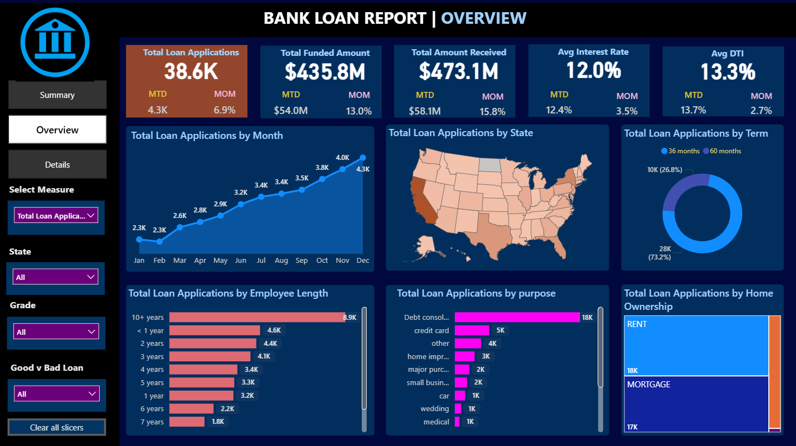
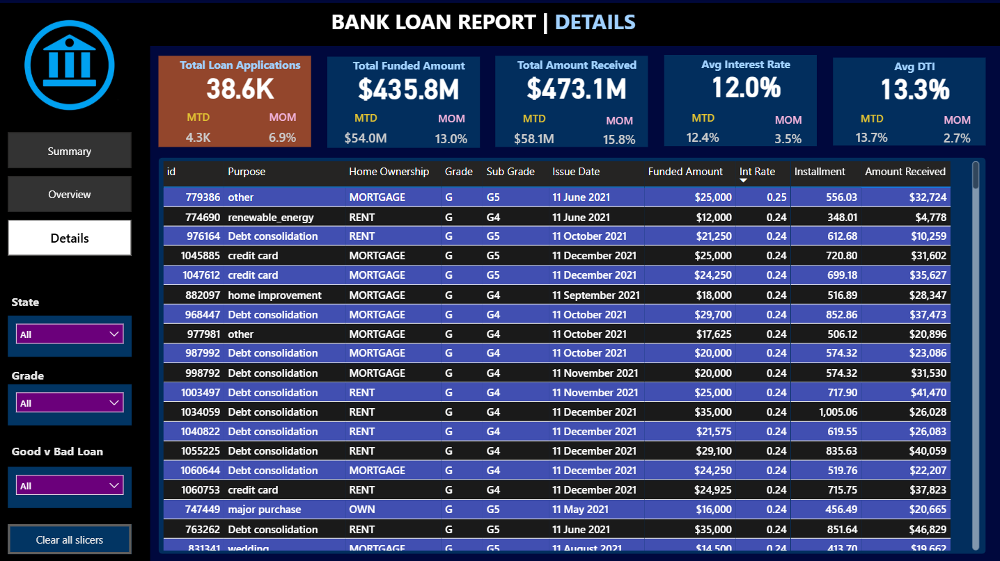

# 📊 Bank Loan Analysis Dashboard

## **Overview**
This project presents an **end-to-end Bank Loan Analysis Dashboard** that provides actionable insights into loan applications, funded amounts, received amounts, interest rates, and borrower profiles.  
The solution is divided into **three interactive dashboards** — Summary, Overview, and Details — offering a comprehensive, data-driven approach to monitor and evaluate loan portfolio performance.

All **KPIs and visualizations have been validated using SQL queries**, enabling clients to cross-verify results directly from the database.

---

## **Business Problem**
The lending institution required a clear and interactive reporting system to:
- Monitor **total loan applications** and trends.
- Track **funded amounts** and **amounts received** over time.
- Differentiate between **good loans** and **bad loans**.
- Identify **seasonal trends, regional differences**, and borrower characteristics.
- Offer a **detailed, drill-down view** for transaction-level loan data.
  
The existing process was fragmented, lacked real-time validation, and did not provide consolidated insights for decision-making.

---

## **Tools & Technologies**
- **Power BI** – For dashboard design and visualization.
- **SQL** – For validating KPIs and charts to ensure data accuracy.
- **Excel/CSV Data** – Source data for analysis.
- **DAX** – For custom metrics in Power BI.
- **ETL Processes** – For cleaning and preparing raw data.

---

## **Data Source**

The dataset used in this Power BI project was retrieved directly from a SQL Server database.
I used SQL queries to extract relevant tables and fields.

---

## **Research Questions & Key Findings**

### **Research Questions**
1. How many total loan applications were received and how have they changed Month-over-Month (MoM)?
2. What is the total funded amount and total amount received MTD and MoM?
3. What percentage of loans are classified as **Good Loans** vs. **Bad Loans**?
4. How do loan applications vary by **region, term length, employee tenure, loan purpose, and home ownership**?
5. Which states and loan purposes contribute most to loan volume?
6. How do interest rates and debt-to-income ratios (DTI) vary across loan statuses?

### **Key Findings**
- **Total Loan Applications:** 38.6K (MoM growth: 6.9%).
- **Good Loan Percentage:** 86.2%, indicating strong portfolio quality.
- **Highest Loan Purpose:** Debt consolidation (18K applications).
- **Top Employee Tenure Segment:** 10+ years (8.9K applications).
- **Funded vs. Received:** $435.8M funded and $473.1M received.
- **Interest Rates:** Average 12%, with minor MoM fluctuations.
- **Regional Patterns:** Certain states show higher application volumes, influencing funding allocation.

---

## **Dashboard**

### **1. Summary Dashboard**
[

---

### **2. Overview Dashboard**
[

---

### **3. Details Dashboard**
[

---

### **SQL Validation of Dashboard Results**

To ensure accuracy and reliability, all KPIs and visualizations have been independently validated using SQL queries.

For each KPI:

- The exact SQL query used to derive the metric is documented.

- A screenshot of the SQL output is included.

- Clients can run the queries directly on their own database to cross-check results.

*** Benefits of SQL Validation:***
” metrics.
1. Transparent calculations .

2. Guarantees Power BI results match database values.

3. Audit-ready records for compliance and accuracy checks.

## **Final Recommendations**
1. **Focus on Good Loan Segments:** With over 86% of loans in the good category, expanding funding to these profiles can strengthen returns.
2. **Target High-Volume Purposes:** Debt consolidation and credit card loans dominate applications—tailored products can improve conversion.
3. **Regional Expansion:** States with high demand should be prioritized for marketing and loan officer deployment.
4. **Leverage Employee Tenure Insights:** Longer employment history correlates with better loan performance—consider as a stronger approval criterion.
5. **Continuous SQL Validation:** Maintain SQL-based cross-verification for transparency and audit-readiness.

---

## **Author**
**Author:** Sanjay Kumar  
